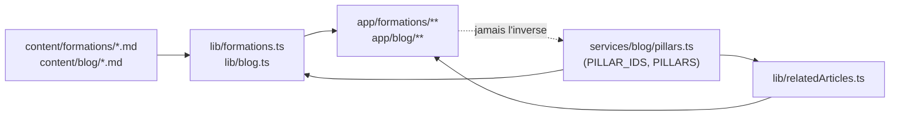

# Architecture Spine — Refonte Formations / Coaching / GAPP — elancestvous.fr

## Design Paradigm

**Content-as-code**, déjà en place pour le blog et étendu tel quel aux
formations : le contenu long-tail vit en fichiers Markdown validés par un
schéma zod (`lib/blog.ts`, et son miroir `lib/formations.ts`), jamais en base
de données. Les pages courtes et stables (hubs, thèmes, GAPP, Coaching) restent
du **code hand-authored** — un `page.tsx` par route, pas un rendu générique
piloté par contenu. Les deux paradigmes coexistent déjà dans le dépôt ; cette
refonte ne fait qu'étendre le premier à un deuxième répertoire de contenu
(`content/formations/`) sans changer le second.

## Invariants & Rules



### AD-1 — Le contenu formations suit le paradigme content-as-code du blog, avec une classification propre découplée du blog

- **Binds:** FR-3
- **Prevents:** Un deuxième système de contenu (CMS, base de données, ou schéma
  de validation maison) divergent de celui déjà éprouvé pour le blog ; un
  couplage artificiel entre la classification du catalogue (4 Familles) et la
  rotation éditoriale du blog (Piliers) qui forcerait à créer des Piliers
  blog rien que pour satisfaire la validation d'une Fiche formation.
- **Rule:** `content/formations/<slug>.md`, parsé par un nouveau
  `lib/formations.ts` qui réplique le paradigme de `lib/blog.ts` :
  `gray-matter` + schéma `zod`, détection de slug dupliqué, un type
  `FormationMeta` exporté. Le champ obligatoire est **`famille`**, pas
  `pillar` — un enum local à `lib/formations.ts` à 4 valeurs fixes
  (`cadre-legal-etablissements-sante`, `prevention-rps-qvct-etablissements-sante`,
  `accompagnement-professionnel-etablissements-sante`,
  `dynamique-equipe-etablissements-sante`), **jamais** validé contre
  `PILLAR_IDS` de `services/blog/pillars.ts`. Les deux enums restent
  distincts et non synchronisés : une Fiche formation ne référence jamais un
  Pilier blog. `[SUPERSEDES la version initiale de cet AD, qui prévoyait un
  champ `pillar` partagé — corrigée après ratification du pivot de taxonomie
  PRD : les Familles 3 et 4 n'ont pas de Pilier blog équivalent, cf. AD-2.]`

### AD-2 — Le pilier "F" (Cadre légal) ne casse la généricité d'aucun mécanisme existant ; seules 2 des 4 Familles ont un Pilier

- **Binds:** FR-6, FR-10
- **Prevents:** Un `if (pillar.id === "F")` qui se glisserait dans
  `pickNextPillar`, `getRelatedArticleLinks` ou `ArticlesBlogLiesBloc` ; un
  Pilier blog créé par pure symétrie avec une Famille catalogue qui n'a pas de
  besoin éditorial identifié.
- **Rule:** `services/blog/pillars.ts` gagne une entrée
  `{ id: "F", label: "Cadre légal, droits et éthique", targetPage:
  "/formations/cadre-legal-etablissements-sante", weight: 4, ... }` dans le tableau
  `PILLARS`. Le `targetPage` de l'entrée `C` existante ("Formations") est mis
  à jour vers `/formations/prevention-rps-qvct-etablissements-sante` (son hub successeur). Les
  Familles "Accompagnement et pratiques professionnelles" et "Dynamique
  d'équipe et développement professionnel" n'ont **aucune** entrée `PILLARS`
  correspondante — leurs hubs affichent un `ArticlesBlogLiesBloc` qui ne rend
  rien (`targetPage` sans match dans `PILLARS`, comportement déjà natif du
  composant, aucun code spécifique requis). Aucun autre fichier ne référence
  l'id `"F"` littéralement — `pickNextPillar`, `getRelatedArticleLinks`
  (`lib/relatedArticles.ts`) et `ArticlesBlogLiesBloc` restent strictement
  génériques par construction (vérifié : ils itèrent déjà sur
  `PILLARS`/comparent des ids sans branchement nominal). `[ADOPTED]`

### AD-3 — Les redirections vivent dans `next.config.ts`, jamais dans un middleware

- **Binds:** FR-2
- **Prevents:** Une deuxième couche de routing (middleware Next.js) pour un
  besoin purement statique — deux endroits pour comprendre "où va cette URL".
- **Rule:** Toutes les redirections 301 de l'ancien vers le nouveau schéma
  d'URL sont déclarées dans le bloc `async redirects()` de `next.config.ts`
  (à ajouter à côté du bloc `async headers()` déjà présent). Aucun
  `middleware.ts` n'est introduit pour ce besoin. `[ADOPTED — le dépôt n'a
  actuellement aucun middleware ; redirects() est le chemin de moindre
  divergence, tranche l'Open Question 2 du PRD.]`

### AD-4 — Une route = un fichier écrit à la main ; seule la fiche formation est un segment dynamique

- **Binds:** FR-2, FR-5, FR-7, FR-8, FR-9
- **Prevents:** Un moteur de rendu générique "hub" qui masquerait le contenu
  marketing spécifique à chaque page derrière un template commun — perte de
  contrôle éditorial et risque direct pour FR-7 (contenu conservé).
- **Rule:** Chaque hub et chaque Famille est un `page.tsx` statique dédié —
  `app/formations/page.tsx`,
  `app/formations/cadre-legal-etablissements-sante/page.tsx`,
  `app/formations/prevention-rps-qvct-etablissements-sante/page.tsx`,
  `app/formations/accompagnement-professionnel-etablissements-sante/page.tsx`,
  `app/formations/dynamique-equipe-etablissements-sante/page.tsx`,
  `app/coaching/page.tsx`, `app/coaching/particuliers/page.tsx`,
  `app/coaching/etablissements/page.tsx`,
  `app/gapp-analyse-pratiques-professionnelles/page.tsx` — cohérent avec la
  convention déjà en place où chaque page de service est du code, pas du
  contenu templaté. Seule la Fiche formation individuelle est un segment
  dynamique, `app/formations/[famille]/[slug]/page.tsx` (segment renommé
  depuis `[theme]` pour rester cohérent avec le vocabulaire Glossary du PRD),
  avec `generateStaticParams` sur `lib/formations.ts` — miroir exact du
  paradigme `app/blog/[slug]/page.tsx` déjà en place.

### AD-5 — Le filtre de catégorie du catalogue vit dans l'URL, pas dans un state client

- **Binds:** FR-4
- **Prevents:** Un filtre qui ne survit pas au rafraîchissement, n'est pas
  partageable, et introduit une gestion d'état client absente du reste du
  site.
- **Rule:** `/formations` lit son filtre actif depuis `searchParams` (ex.
  `?famille=prevention-rps-qvct-etablissements-sante`) sur le Server Component de la page ; les
  pastilles de catégorie sont des `<Link>` qui changent ce paramètre, jamais
  un état React local. `[ADOPTED — tranche l'Open Question 4 du PRD.]`

### AD-6 — Un seul composant bouton ; le CTA secondaire teinté en est un variant

- **Binds:** FR-12
- **Prevents:** Un deuxième composant bouton (ou des classes Tailwind
  répétées à la main sur chaque page) qui diverge silencieusement du premier
  au fil des retouches.
- **Rule:** `components/ui/button.tsx` (`buttonVariants`, `cva`) gagne une
  entrée `variant` supplémentaire (contour + fond légèrement teinté) plutôt
  qu'un nouveau composant. Toute surface qui affiche un CTA "Découvrir" / "Voir
  la fiche" utilise `<Button variant="...">`, jamais un `<a>` stylé à la main.

## Consistency Conventions

| Concern | Convention |
| --- | --- |
| Contenu formation (slugs, dates) | Slug kebab-case (même regex que `lib/blog.ts`) ; pas de champ date de publication (contenu non chronologique, contrairement au blog) |
| Pilier (blog) vs Famille (catalogue) | Deux enums séparés et non synchronisés : `PILLAR_IDS` (`services/blog/pillars.ts`, blog uniquement) et l'enum `famille` local à `lib/formations.ts` (catalogue uniquement) — jamais fusionnés, jamais l'un validé contre l'autre |
| Champs Qualiopi manquants | Placeholder explicite dans le contenu (ex. `[À confirmer]`), jamais une valeur inventée au build |
| CTA de découverte | Toujours `<Button variant="...">`, jamais un lien texte nu ni un `<a>` stylé inline |
| Tokens visuels (couleur, radius, espacement) | Échelle Tailwind par défaut uniquement — aucune valeur arbitraire hors échelle (déjà vérifié sur les maquettes de cette session) |

## Stack

| Name | Version |
| --- | --- |
| Next.js (App Router) | 16.2.2 |
| React | 19.2.4 |
| zod | ^4.3.6 |
| gray-matter | (déjà utilisé par lib/blog.ts, inchangé) |

## Structural Seed

```text
app/
  formations/
    page.tsx                                            # catalogue, lit searchParams?famille=
    cadre-legal-etablissements-sante/page.tsx           # hub Famille 1
    prevention-rps-qvct-etablissements-sante/page.tsx   # hub Famille 2, contenu repris de l'actuel formations-rps-qvct
    accompagnement-professionnel-etablissements-sante/page.tsx  # hub Famille 3 (contenu marketing à rédiger, pas de page existante)
    dynamique-equipe-etablissements-sante/page.tsx      # hub Famille 4 (idem)
    [famille]/[slug]/page.tsx                           # fiche formation individuelle (dynamique)
  coaching/
    page.tsx                        # hub, distribue vers les deux publics
    particuliers/page.tsx
    etablissements/page.tsx
  gapp-analyse-pratiques-professionnelles/
    page.tsx
content/
  formations/
    <slug>.md                       # frontmatter zod : famille obligatoire (4 valeurs) + champs Qualiopi
lib/
  formations.ts                     # miroir de lib/blog.ts ; enum famille local, indépendant de PILLAR_IDS
services/blog/
  pillars.ts                        # + pilier F (Cadre légal), poids 4 ; pilier C retargeté vers /formations/prevention-rps-qvct-etablissements-sante
components/ui/
  button.tsx                        # + variant CTA secondaire teinté
next.config.ts                      # + async redirects()
```

## Capability → Architecture Map

| Capability / Area | Lives in | Governed by |
| --- | --- | --- |
| FR-1 Nav 3 piliers | `components/Navbar.tsx` (existant, à mettre à jour) | AD-4 |
| FR-2 URLs + redirections | `next.config.ts`, arborescence `app/` | AD-3, AD-4 |
| FR-3 Modèle de contenu formation (champ `famille`) | `content/formations/`, `lib/formations.ts` | AD-1 |
| FR-4 Catalogue filtrable par Famille | `app/formations/page.tsx` | AD-5 |
| FR-5 Fiche formation | `app/formations/[famille]/[slug]/page.tsx` | AD-1, AD-4 |
| FR-6 Pilier blog "F" + retargeting pilier "C" | `services/blog/pillars.ts` | AD-2 |
| FR-7 à FR-9 Hubs (contenu conservé, ordre, tuiles vers les 4 Familles) | `app/formations/*/page.tsx`, `app/coaching/*/page.tsx` | AD-4 |
| FR-10 Maillage retour blog | `components/ArticlesBlogLiesBloc.tsx`, `lib/relatedArticles.ts` (inchangés) | AD-2 |
| FR-11 Home en tuiles | `components/home/Axes.tsx` | — (pas d'invariant cross-unité, seed pur) |
| FR-12 Bouton CTA secondaire | `components/ui/button.tsx` | AD-6 |

## Deferred

- **Sort du bouton "Particuliers" du header** (Open Question 1 du PRD) —
  décision produit/UX, pas un invariant technique ; n'affecte aucun AD
  ci-dessus quel que soit le sens de la décision.
- **Volume et calendrier de rédaction du reste du catalogue** (Open Question 3
  du PRD) — chantier de contenu, pas d'architecture ; le modèle (AD-1) supporte
  déjà un nombre arbitraire de fiches par thème.
- **Feature flag de lancement pour les formations** (à la manière de
  `BLOG_ENABLED`) — non demandé par le PRD ; à ajouter si un besoin de
  lancement progressif apparaît, sans impact sur les AD ci-dessus.
- **Génération de vraies photos par pilier** — hors scope du PRD (Non-Goals) ;
  l'illustration plate maison actuelle n'engage aucun invariant.
- **Piliers blog pour les Familles "Accompagnement et pratiques
  professionnelles" et "Dynamique d'équipe et développement professionnel"**
  (Open Question 5 du PRD) — décision produit/éditoriale (dilution du poids
  de rotation des piliers existants si ajoutés), pas un invariant technique ;
  AD-1 et AD-2 supportent déjà l'ajout d'un pilier `PILLARS` sans changement
  de schéma si la décision est prise plus tard.
- **Contenu marketing des hubs Famille 3 et 4** — contrairement aux Familles
  1 et 2 qui reprennent des pages existantes (FR-7), ces deux hubs n'ont
  aucun contenu source à migrer et devront être rédigés depuis zéro ; hors
  scope de cette spine (contenu, pas architecture).
