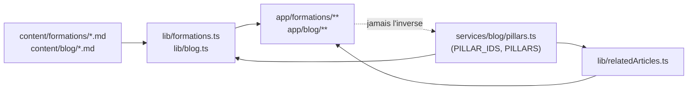

# Architecture Spine — Refonte Formations / Coaching / GAPP — elancestvous.fr

## Design Paradigm

**Content-as-code**, déjà en place pour le blog et étendu tel quel aux
formations : le contenu long-tail vit en fichiers Markdown validés par un
schéma zod (`lib/blog.ts`, et son miroir `lib/formations.ts`), jamais en base
de données. Les pages courtes et stables (hubs, thèmes, GAPP, Coaching) restent
du **code hand-authored** — un `page.tsx` par route, pas un rendu générique
piloté par contenu. Les deux paradigmes coexistent déjà dans le dépôt ; cette
refonte ne fait qu'étendre le premier à un deuxième répertoire de contenu
(`content/formations/`) sans changer le second.

## Invariants & Rules



### AD-1 — Le contenu formations suit le paradigme content-as-code du blog

- **Binds:** FR-3
- **Prevents:** Un deuxième système de contenu (CMS, base de données, ou schéma
  de validation maison) divergent de celui déjà éprouvé pour le blog.
- **Rule:** `content/formations/<slug>.md`, parsé par un nouveau
  `lib/formations.ts` qui réplique le paradigme de `lib/blog.ts` :
  `gray-matter` + schéma `zod`, détection de slug dupliqué, un type
  `FormationMeta` exporté. Le champ `pillar` est **obligatoire** (jamais
  `nullable`, contrairement au champ historique du blog qui tolère les
  articles pré-#73) et validé contre le **même** `PILLAR_IDS` exporté de
  `services/blog/pillars.ts` — jamais un enum de piliers dupliqué ou
  redéfini localement. `[ADOPTED — ratifié depuis lib/blog.ts lu intégralement.]`

### AD-2 — Le pilier "F" (Obligations légales) ne casse la généricité d'aucun mécanisme existant

- **Binds:** FR-6, FR-10
- **Prevents:** Un `if (pillar.id === "F")` qui se glisserait dans
  `pickNextPillar`, `getRelatedArticleLinks` ou `ArticlesBlogLiesBloc`.
- **Rule:** `services/blog/pillars.ts` gagne une entrée
  `{ id: "F", label: "Obligations légales", targetPage:
  "/formations/obligations-legales-etablissements", weight: 4, ... }` dans le
  tableau `PILLARS`. Aucun autre fichier ne référence l'id `"F"` littéralement
  — `pickNextPillar`, `getRelatedArticleLinks` (`lib/relatedArticles.ts`) et
  `ArticlesBlogLiesBloc` restent strictement génériques par construction
  (vérifié : ils itèrent déjà sur `PILLARS`/comparent des ids sans branchement
  nominal). `[ADOPTED]`

### AD-3 — Les redirections vivent dans `next.config.ts`, jamais dans un middleware

- **Binds:** FR-2
- **Prevents:** Une deuxième couche de routing (middleware Next.js) pour un
  besoin purement statique — deux endroits pour comprendre "où va cette URL".
- **Rule:** Toutes les redirections 301 de l'ancien vers le nouveau schéma
  d'URL sont déclarées dans le bloc `async redirects()` de `next.config.ts`
  (à ajouter à côté du bloc `async headers()` déjà présent). Aucun
  `middleware.ts` n'est introduit pour ce besoin. `[ADOPTED — le dépôt n'a
  actuellement aucun middleware ; redirects() est le chemin de moindre
  divergence, tranche l'Open Question 2 du PRD.]`

### AD-4 — Une route = un fichier écrit à la main ; seule la fiche formation est un segment dynamique

- **Binds:** FR-2, FR-5, FR-7, FR-8, FR-9
- **Prevents:** Un moteur de rendu générique "hub" qui masquerait le contenu
  marketing spécifique à chaque page derrière un template commun — perte de
  contrôle éditorial et risque direct pour FR-7 (contenu conservé).
- **Rule:** Chaque hub et chaque thème est un `page.tsx` statique dédié —
  `app/formations/page.tsx`, `app/formations/qvct/page.tsx`,
  `app/formations/rps/page.tsx`,
  `app/formations/gestion-stress-emotions/page.tsx`,
  `app/formations/obligations-legales-etablissements/page.tsx`,
  `app/coaching/page.tsx`, `app/coaching/particuliers/page.tsx`,
  `app/coaching/etablissements/page.tsx`,
  `app/gapp-analyse-pratiques-professionnelles/page.tsx` — cohérent avec la
  convention déjà en place où chaque page de service est du code, pas du
  contenu templaté. Seule la Fiche formation individuelle est un segment
  dynamique, `app/formations/[theme]/[slug]/page.tsx`, avec
  `generateStaticParams` sur `lib/formations.ts` — miroir exact du paradigme
  `app/blog/[slug]/page.tsx` déjà en place.

### AD-5 — Le filtre de catégorie du catalogue vit dans l'URL, pas dans un state client

- **Binds:** FR-4
- **Prevents:** Un filtre qui ne survit pas au rafraîchissement, n'est pas
  partageable, et introduit une gestion d'état client absente du reste du
  site.
- **Rule:** `/formations` lit son filtre actif depuis `searchParams` (ex.
  `?theme=qvct`) sur le Server Component de la page ; les pastilles de
  catégorie sont des `<Link>` qui changent ce paramètre, jamais un état React
  local. `[ADOPTED — tranche l'Open Question 4 du PRD.]`

### AD-6 — Un seul composant bouton ; le CTA secondaire teinté en est un variant

- **Binds:** FR-12
- **Prevents:** Un deuxième composant bouton (ou des classes Tailwind
  répétées à la main sur chaque page) qui diverge silencieusement du premier
  au fil des retouches.
- **Rule:** `components/ui/button.tsx` (`buttonVariants`, `cva`) gagne une
  entrée `variant` supplémentaire (contour + fond légèrement teinté) plutôt
  qu'un nouveau composant. Toute surface qui affiche un CTA "Découvrir" / "Voir
  la fiche" utilise `<Button variant="...">`, jamais un `<a>` stylé à la main.

## Consistency Conventions

| Concern | Convention |
| --- | --- |
| Contenu formation (slugs, dates) | Slug kebab-case (même regex que `lib/blog.ts`) ; pas de champ date de publication (contenu non chronologique, contrairement au blog) |
| Pilier | Un seul enum source (`PILLAR_IDS`, `services/blog/pillars.ts`) consommé par le blog **et** les formations — jamais redéfini |
| Champs Qualiopi manquants | Placeholder explicite dans le contenu (ex. `[À confirmer]`), jamais une valeur inventée au build |
| CTA de découverte | Toujours `<Button variant="...">`, jamais un lien texte nu ni un `<a>` stylé inline |
| Tokens visuels (couleur, radius, espacement) | Échelle Tailwind par défaut uniquement — aucune valeur arbitraire hors échelle (déjà vérifié sur les maquettes de cette session) |

## Stack

| Name | Version |
| --- | --- |
| Next.js (App Router) | 16.2.2 |
| React | 19.2.4 |
| zod | ^4.3.6 |
| gray-matter | (déjà utilisé par lib/blog.ts, inchangé) |

## Structural Seed

```text
app/
  formations/
    page.tsx                        # catalogue, lit searchParams?theme=
    qvct/page.tsx                   # hub thème, contenu repris de l'actuel formations-rps-qvct
    rps/page.tsx
    gestion-stress-emotions/page.tsx
    obligations-legales-etablissements/page.tsx
    [theme]/[slug]/page.tsx         # fiche formation individuelle (dynamique)
  coaching/
    page.tsx                        # hub, distribue vers les deux publics
    particuliers/page.tsx
    etablissements/page.tsx
  gapp-analyse-pratiques-professionnelles/
    page.tsx
content/
  formations/
    <slug>.md                       # frontmatter zod : pillar obligatoire + champs Qualiopi
lib/
  formations.ts                     # miroir de lib/blog.ts
services/blog/
  pillars.ts                        # + pilier F (Obligations légales), poids 4
components/ui/
  button.tsx                        # + variant CTA secondaire teinté
next.config.ts                      # + async redirects()
```

## Capability → Architecture Map

| Capability / Area | Lives in | Governed by |
| --- | --- | --- |
| FR-1 Nav 3 piliers | `components/Navbar.tsx` (existant, à mettre à jour) | AD-4 |
| FR-2 URLs + redirections | `next.config.ts`, arborescence `app/` | AD-3, AD-4 |
| FR-3 Modèle de contenu formation | `content/formations/`, `lib/formations.ts` | AD-1 |
| FR-4 Catalogue filtrable | `app/formations/page.tsx` | AD-5 |
| FR-5 Fiche formation | `app/formations/[theme]/[slug]/page.tsx` | AD-1, AD-4 |
| FR-6 Pilier blog "F" | `services/blog/pillars.ts` | AD-2 |
| FR-7 à FR-9 Hubs (contenu conservé, ordre, groupes sémantiques) | `app/formations/*/page.tsx`, `app/coaching/*/page.tsx` | AD-4 |
| FR-10 Maillage retour blog | `components/ArticlesBlogLiesBloc.tsx`, `lib/relatedArticles.ts` (inchangés) | AD-2 |
| FR-11 Home en tuiles | `components/home/Axes.tsx` | — (pas d'invariant cross-unité, seed pur) |
| FR-12 Bouton CTA secondaire | `components/ui/button.tsx` | AD-6 |

## Deferred

- **Sort du bouton "Particuliers" du header** (Open Question 1 du PRD) —
  décision produit/UX, pas un invariant technique ; n'affecte aucun AD
  ci-dessus quel que soit le sens de la décision.
- **Volume et calendrier de rédaction du reste du catalogue** (Open Question 3
  du PRD) — chantier de contenu, pas d'architecture ; le modèle (AD-1) supporte
  déjà un nombre arbitraire de fiches par thème.
- **Feature flag de lancement pour les formations** (à la manière de
  `BLOG_ENABLED`) — non demandé par le PRD ; à ajouter si un besoin de
  lancement progressif apparaît, sans impact sur les AD ci-dessus.
- **Génération de vraies photos par pilier** — hors scope du PRD (Non-Goals) ;
  l'illustration plate maison actuelle n'engage aucun invariant.
